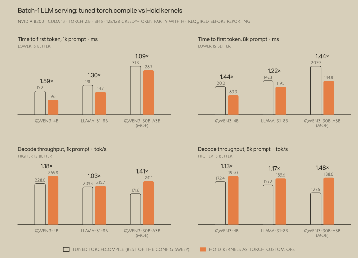
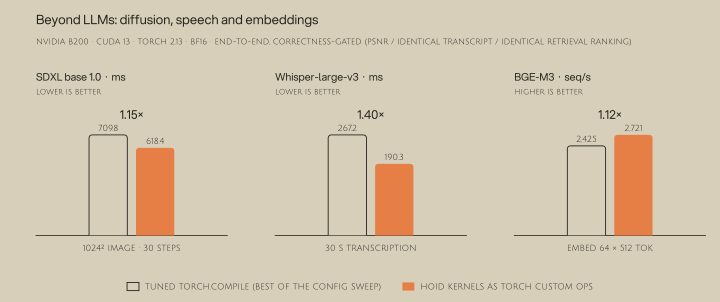

# Hoid optimized models

This repo highlights models where hoid-generated kernels achieve superior performance compared to PyTorch. Every model is pure PyTorch - the winning kernels run as torch custom ops (CUDA / Triton / CuTe DSL, JIT-compiled at import), with no hoid runtime involved.

Each folder is self-sufficient: its own pinned `uv` environment, a `best_torch.py` that derives the strongest stock `torch.compile` configuration on your box, and a `best_hoid.py` runs the hoid implementaiton. 

## Quick Start
To run any model:

```bash
cd models/<model>
uv sync
uv run best_torch.py && uv run best_hoid.py
```

Each model's README has the exact commands and the full measured table. To get the best torch baseline, `best_torch.py` sweeps a whole configuration lattice (eager SDPA, compile default, reduce-overhead, max-autotune, …) and the hoid stack is compared against the per-metric best of it.


## Results
All numbers below were measured on an NVIDIA B200 (CUDA 13.0, torch 2.13.0+cu130, bf16); the kernels target Blackwell (sm100). Prerequisites: CUDA 13 with `nvcc` on PATH and [uv](https://docs.astral.sh/uv/). 



Batch-1 serving: [qwen3-4b](models/qwen3-4b), [llama31-8b](models/llama31-8b) and [qwen3-30b-a3b](models/qwen3-30b-a3b) (MoE).



Beyond LLMs: [sdxl](models/sdxl) (one 1024×1024 image, 30 steps), [whisper-large-v3](models/whisper-large-v3) (transcribe a real 30 s window) and [bge-m3](models/bge-m3) (embed batch 64 × seq 512).
